# SafeRAG — Private, Offline Document Intelligence 🛡️

> **Evidence-First Document Investigation & Analysis Platform — 100% Local, Offline, and Air-Gapped.**

SafeRAG is an enterprise-grade document intelligence system designed for high-security, privacy-critical industries (aviation maintenance, defence, healthcare, and compliance). By combining local dense embeddings, vector retrieval, cross-encoder reranking, and an **extractive QA model**, SafeRAG guarantees zero hallucinations by returning exact, verifiable evidence spans directly from source documents.

---

## 🌟 Key Features

- 🔒 **100% Offline & Air-Gapped**: Runs entirely on local infrastructure with zero internet connectivity or cloud API calls after initial model download.
- 🎯 **Zero Hallucinations (Extractive QA)**: Uses an extractive span QA model (`roberta-base-squad2`) instead of generative LLMs — returning exact, highlighted text spans backed by confidence scores.
- ⚡ **Actian Database AI Vector Engine**: Powered by high-performance vector indexing (`Actian VectorAI` interface / disk-persistent Qdrant).
- 📄 **Multimodal OCR & Layout Parsing**: Built-in `Docling` + `RapidOCR` engine handles scanned PDFs, complex tables, and multi-page technical manuals seamlessly.
- 🏷️ **Domain Normalization**: Automatic technical abbreviation expansion (e.g., `HPC` → *High Pressure Compressor*, `FOD` → *Foreign Object Damage*).
- 📊 **Transparent Confidence Badge**: Multi-factor confidence reasoning evaluated per query based on source diversity, reranker logits, and QA span probabilities.

---

## 🏗️ Architecture & 9-Stage Pipeline

```mermaid
flowchart TD
    subgraph Offline Ingestion Pipeline
        A[Raw Documents / PDFs / Incident JSONs] --> B[Stage 1: Ingestion & Metadata Parsing]
        B --> C[Stage 2: Docling & RapidOCR Layout Extraction]
        C --> D[Stage 3: Domain Normalization]
        D --> E[Stage 4: Semantic Chunking 300-400 tokens]
        E --> F[Stage 5: EmbeddingGemma-300M Embedder]
        F --> G[Stage 6: Actian VectorAI Indexing]
    end

    subgraph Online Query Pipeline
        H[User Query / Incident Report] --> I[Stage 3: Query Domain Normalization]
        I --> J[Stage 5: Query Vector Embedding]
        J --> K[Stage 7: Actian Vector Retrieval Top-20]
        K --> L[Stage 8: Qwen3-Reranker-0.6B Reranking]
        L --> M[Stage 9: RoBERTa Extractive QA & Confidence Scoring]
        M --> N[SafeRAG UI Evidence Cards]
    end
```



### Stage Breakdown

1. **Stage 1 (Ingestion)**: Discovers and parses PDFs, text files, and structured JSON incident logs.
2. **Stage 2 (Docling OCR)**: Extracts native text layers and runs OCR on scanned pages, bailing out gracefully on corrupt PDF streams.
3. **Stage 3 (Domain Normalization)**: Expands domain-specific shorthand using static dictionaries (`data/normalization/aviation.json`).
4. **Stage 4 (Chunking)**: Splits text into ~300-400 token passages with 50-token overlap, preserving metadata tags (`aircraft_model`, `engine_model`, `ata_chapter`).
5. **Stage 5 (Embedding)**: Generates 768-dimensional dense vectors using `google/embeddinggemma-300m`.
6. **Stage 6 (Indexing)**: Stores vectors and payloads in **Actian VectorAI** / persistent local Qdrant database.
7. **Stage 7 (Retrieval)**: Queries top-20 vector candidates with optional metadata filtering.
8. **Stage 8 (Reranking)**: Cross-encoder reranking with `Qwen/Qwen3-Reranker-0.6B` to filter out irrelevant candidates.
9. **Stage 9 (Extractive QA)**: Computes start/end span probabilities using `deepset/roberta-base-squad2` and assigns transparent confidence levels (*High / Medium / Low*).

---

## 🤖 Local ML Stack Breakdown

| Component | Model | Parameters | Purpose |
| :--- | :--- | :--- | :--- |
| **Parsing & OCR** | Docling / RapidOCR | ~40M | PDF layout extraction & table parsing |
| **Embedder** | `google/embeddinggemma-300m` | ~300M | 768-dim dense semantic embeddings |
| **Reranker** | `Qwen/Qwen3-Reranker-0.6B` | ~600M | Cross-encoder relevance scoring |
| **Extractive QA** | `deepset/roberta-base-squad2` | ~125M | Verifiable answer span extraction |
| **Total Stack** | **4 Task-Specific Models** | **~1.1 Billion** | Fully local, offline CPU/GPU inference |

---

## 🚀 Quick Start Guide

### Prerequisites

- **Python 3.10+**
- **Node.js 18+** & **npm**

---

### Step 1: Clone the Repository

```bash
git clone https://github.com/mouli-tech2025/Hexa_RAG.git
cd Hexa_RAG
```

---

### Step 2: Set Up & Launch Python Backend

```bash
# Navigate to backend directory
cd RAG/backend

# Create virtual environment
python -m venv venv

# Activate virtual environment
# On macOS / Linux:
source venv/bin/activate
# On Windows Command Prompt / PowerShell:
venv\Scripts\activate

# Install dependencies
pip install -r requirements.txt

# Start the FastAPI backend server
uvicorn main:app --host 0.0.0.0 --port 8000
```

> **Note**: On first startup, the backend automatically initializes the ML models and populates the vector store from sample data. Subsequent restarts load instantly in ~30 seconds.

---

### Step 3: Set Up & Launch Next.js Frontend (Second Terminal)

```bash
# Navigate to frontend directory
cd RAG/frontend

# Install dependencies
npm install

# Start the development server
npm run dev
```

Open `http://localhost:3000` in your browser to start investigating!

---

## 📡 API Reference

### 1. Health Check
`GET http://localhost:8000/health`

**Response:**
```json
{
  "app_name": "SafeRAG",
  "status": "ok",
  "actian_reachable": true,
  "embedders_loaded": true,
  "models_loaded": true
}
```

### 2. Evidence Investigation
`POST http://localhost:8000/investigate`

**Request Body:**
```json
{
  "fault_code": "EGT-001",
  "query": "HPC blade Foreign Object Damage during takeoff",
  "aircraft_model": "A320",
  "engine_model": "CFM56",
  "ata_chapter": "72"
}
```

---

## 📁 Repository Structure

```
SafeRAG/
├── RAG/
│   ├── backend/
│   │   ├── config.py                 # Configuration & calibrated thresholds
│   │   ├── main.py                   # FastAPI server & lifespan startup hook
│   │   ├── ingest.py                 # Offline document ingestion script
│   │   ├── requirements.txt          # Backend Python dependencies
│   │   ├── data/                     # FAA sample docs & incident reports
│   │   └── stages/                   # 9 modular execution stages
│   │       ├── stage_1_ingest.py
│   │       ├── stage_2_docling.py
│   │       ├── stage_3_normalize.py
│   │       ├── stage_4_chunk.py
│   │       ├── stage_5_embed.py
│   │       ├── stage_6_actian.py    # Actian VectorAI database interface
│   │       ├── stage_7_retrieve.py
│   │       ├── stage_8_rerank.py
│   │       └── stage_9_qa.py
│   │
│   └── frontend/                     # Next.js 16 Web Application
│       ├── app/                      # App router (Landing & Investigation pages)
│       ├── components/               # UI components (ConfidenceBadge, EvidenceCardItem)
│       ├── public/                   # Favicon and static assets
│       └── package.json
│
└── requirements.txt                  # Root Python requirements
```

---

## 🛡️ Security & Privacy

SafeRAG processes all documents, vector math, and span extraction **locally in RAM/disk**. No telemetry, telemetry pings, or analytics are transmitted.

---

## 📄 License

Distributed under the MIT License. See `LICENSE` for more information.
